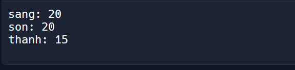

 

C++ Set and Map Collection
==========================

Tổng quan
---------

Bài này nói về `set` và `map` trong `c++`

Chi tiết
---------

### C++ `set` collection

#### Set là gì ?

\- `set` nó cũng dùng để chứa 1 chuỗi các giá trị giống array trong c++  
\- chỉ khác cái `set` là tập hợp. Đặc điểm của tập hợp là mỗi phần tử chỉ xuất hiện một lần duy nhất (giống y khái niệm "tập hợp" trong toán).  
\- Dù cô có thêm 1 giá trị vào set nhiều lần, thì khi in các phần tử trong set cô cũng chỉ thấy nó xuất hiện 1 lần thôi.  
\- Trong set, các phần tử theo mặc định cũng được xếp theo tăng dần, dù cô thêm các giá trị theo thứ tự là trước hay sau.  
\- Dĩ nhiên cũng có thể cài đặt nó để xếp theo giá trị giảm dần.

#### Thao tác với `set`

\- một `set` gồm các phần tử với 1 kiểu giá trị duy nhất  
\- Thêm thư viện `set`:
```cpp
    #include  <set>  
```
Lưu ý khai báo `using namespace std;`  
\- Tạo một `set` chứa các giá trị với kiểu nhất định :  
```cpp
    set < int>  taphop
```
Tập hợp trên rỗng.  
\- Nếu muốn tạo `set` với thứ tự giảm dần :

```cpp
    set<int, greater<int>> taphop2;
```
    

Thêm các phần tử vào tập hợp thì dùng `insert()`
```cpp
    taphop.insert(10); 
    taphop.insert(1);
    taphop.insert(7);
    taphop.insert(2);
    taphop.insert(1);
```
   

  
\- Dù thứ tự thêm như nào, thứ tự các phần tử vẫn được xếp theo bé đến lớn, hãy thử in ra các phần tử trong tập hợp:

```cpp
    for (auto &phantu : taphop) { /* Lưu ý đây là lấy kiểu tham trị */ 
        cout << phantu << endl;
    } 
```
  
\- Đầu ra sẽ hiển thị : `1 2 7 10`, và dĩ nhiên, dù `1` được insert tận 2 lần, nó vẫn chỉ xuất hiện 1 lần trong tập hợp mà thôi.  
\- Xóa 1 giá trị khỏi tập hợp:
```cpp
    taphop.erase(10);
```
  
\- Lấy số phần tử:
```cpp
    taphop.size()
```
  
\- Kiểm tra xem đó có phải tập rỗng
```cpp
    taphop.empty() /* return true or false */
```
  
\- Kiểm tra 1 phần tử có hay không:
```cpp
    taphop.empty() /* return true or false */
```
  
Kết hợp lại:
```cpp
    #include <iostream> 
    #include <set>
    using namespace std;
    int main() {
        set <int>  taphop;
        taphop.insert(10);
        taphop.insert(1);
        taphop.insert(7);
        taphop.insert(2);
        taphop.insert(1);
        taphop.erase(10);
                            
        cout << "phan tu: " << endl;
        for (auto &phantu : taphop) {
        cout << phantu << endl;
        }                
        cout << "so phan tu: " << taphop.size() << endl;                   
        cout << "kiem tra tap rong: " << taphop.empty() << endl;
        cout << "kiem tra co phan tu co gia tri 10: " << taphop.count(10);
    }
```                   

* * *

### C++ `map` collection

#### Khái niệm

\- `map` gồm các phần tử ở dạng `_"key" - "value"_`, nghĩa là 1 cặp gồm từ khóa - giá trị.  
\- Giống kiểu trong phù hiệu có Tên: Nguyễn Thái Sơn, Lớp: 12A1, Năm học: 2020-2021, thì `Tên, Lớp, Năm học` là các `"key"` và `Nguyễn Thái Sơn, 12A1, 2020-2021` lần lượt và `value` tương ứng  
\- Tạo `map` rỗng:
```cpp
    #include <iostream>
    #include <map>
    using namespace std;
    int main() { 
      map<string, int> mymap; 
    }
```
  
\- Đoạn code trên khởi tạo 1 `map` rỗng với `key` (khóa) là kiểu `string` và `value` (giá trị) là kiểu `int`.

#### Thao tác với `map`

\- Giả sử tạo 1 map để lưu số tuổi. Khi đấy `map` của mình sẽ có `key` là `string` để lưu tên, và `value` là `int` để lưu tuổi tương ứng.
```cpp
    #include <iostream>
    #include <map>
    #include <set>
    using namespace std;
    int main() {
      map<int, string> tuoi;
      tuoi["son"] = 20;
    }
```

\- `map` trên được khởi tạo và có 1 cặp `key - value` là `"son" - 20` - Chỉ cần gán giá trị như trên, `map` sẽ tự động thêm cặp `key - value` vào.  
\- Mỗi `key` của `map` là duy nhất.

```cpp
    tuoi["sang"] = 20;
    tuoi["thanh"] = 15;
```
    

\- Thử in ra những giá trị đó
```cpp
 for (auto &pair : tuoi) {
      cout << pair.first << ": " << pair.second << endl;
}; 
```
   

\- Dùng `first` để lấy `key` và `second` để lấy `value`  

Kết quả:  - Nếu cố lấy 1 phần tử thông qua `key` mà phần tử đó chưa được định nghĩa, `map` cũng sẽ tạo phần tử đó và đặt `value` là `0` (nếu value là int, bool hay các kiểu số khác) hoặc `""` (với value là `string` )
```cpp
 /*cặp giá trị với key là "thu" chưa được khai báo*/ 
      cout << tuoi["thu"] << endl;
```
   

\- Kết quả in ra là `0`.

#### Một số hàm khác

\- Lấy số phần tử map: `tuoi.size()`  
\- Xóa một phần tử: `tuoi.erase("son");`  
\- Kiểm tra xem 1 phần tử với `key` có tồn tại hay không: `tuoi.count("son");`  
\- Xóa hết phần tử trong map: `tuoi.clear();`  
\- Kiểm tra xem map có rỗng hay không: `tuoi.empty()` , trả về 1 nếu rỗng và 0 nếu có phần tử.  
**Tổng hợp lại:**
```cpp
    #include <iostream>
    #include <map>
    #include <set>
    using namespace std;
    int main() {
      map<int, string> tuoi;
      tuoi["son"] = 20;
      tuoi["sang"] = 20;
      tuoi["thanh"] = 15;
                  
      for (auto &pair : tuoi) {
        cout << pair.first << ": " << pair.second << endl;
      };
      // cặp giá trị với key là "thu" chưa được khai báo
      cout << tuoi["thu"] << endl;
                  
      /* In ra số phần tử của map */
      cout << "Số phần tử của map: " << tuoi.size() << endl;
                  
      /* xóa một phần tử của map */
      tuoi.erase("son");
      // kiểm tra xem có tồn tại key "son" không
      cout << "check key \"son\" co ton tai khong: " << tuoi.count("son") << endl;
                  
      /*Xóa hết phần tử trong map*/
      tuoi.clear();
                  
      /* check xem map có rỗng hay không ( .empty() ) */
      cout << "check rong hay khong: " << (tuoi.empty() ? "EMPTY" : "NOT EMPTY")
           << endl;
    }
    
```
* * *

### Các nguồn tham khảo:

[C++ Set Collection](https://www.geeksforgeeks.org/set-in-cpp-stl/)  
[C++ Map Collection](https://www.geeksforgeeks.org/map-associative-containers-the-c-standard-template-library-stl/)

* * *

🧑‍💻🧑‍💻🧑‍💻 Happy coding !!! 🧑‍💻🧑‍💻🧑‍💻
