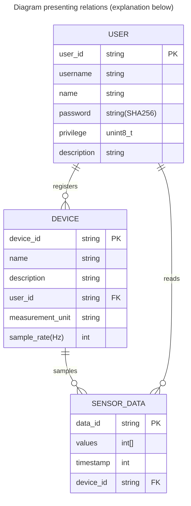
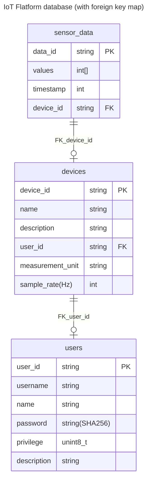

# Database Schema

## Abstraction

This page shows how data are organized in database, 
including entities, relations between them and tables in the database.

## Entitites and Relations

### User registers device

By using GUI, users can register (create) their own devices (devices are sensors, 
or MCUs or anything that samples theirs data), edit the devices' 
description, measurement unit and sample rate for easy further 
calculations and data displaying.

`user_id`, as a device's field, is the id of the user who creates that device, also called `owner`.

If devices are created by guests, the owner/user_id will be set as `NULL` and everyone 
can see those devices' info and data.

### Device samples sensor data

In real life, users' physical devices will send the sensor data to the gateways. The gateways
forward data to master server. Then, the server saves them in as sensor_data 
instance in database.

The data fields include:
- **Values**: the main values of the sensor device to be recorded. In case the 
sensor values can be read in high rate and devices want to send multiple values
in each request/frame, the values field in sensor_data table can be an array,
and attached timestamp is the reading timestamp of the *first* value in that array. 

- **Timestamp**: Timestamp of the data record. If record's sensor values are 
stored as an array. Timestamp is the sampling time of the first value in that
array.

- **Device ID**: Present the origin device of that data, is a foreign key,
refer to `device_id` field of `device` table.

### User reads sensor data

Of course, users can read their data by using our GUI, or calling open APIs.

- `Admins (or admin users)` can read everything.

- `Basic users` can read records from only their devices and guests' devices.

- `Guests` can read records from unowned/guests' devices.

## Tables with fields in database

Diagram below presents 3 core tables:

Foreign keys:

- `user_id` in **devices** table refers to `user_id` in **users**.
- `device_id` in **sensor_data** table refers to `device_id` in **devices**.

***

| What's next ? - [APIs Tutorial](api.md) |
| ------------- |

October 2024 by Thai-Son Nguyen.

 🧑‍💻🧑‍💻🧑‍💻 Happy coding !!! 🧑‍💻🧑‍💻🧑‍💻

