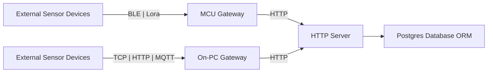

# An overview of the IoT Platform project

## Abstraction

Our first aim is to providing a maintainable and scalable IoT platform accepting, holding and managing multi-type of sensor data. The primary features of this system include: 

- **Multi-protocol support:** Accepting and handling multi-type of wireless protocols: TCP, HTTP, MQTT, BLE, Lora, etc.

- **Data storage and management:** Storing and providing CRUD (Create | Read | Update | Delete) operations for multi-type of sensor data. 

- **Extensibility:** Giving methods for adding and supporting new types of sensor data, ensuring the platform remains adaptable to future needs.

- **Standardized APIs:** Giving standard rules and APIs for integrating other projects (such as lab projects), allowing them to easily send data to the platform.

- **User-friendly interface:** Giving a friendly user-interface to manage all the things.

After reaching this basic aim, we'll go for futher goals in next semester (such as smart plugs network, smart office, etc.) 

## Architecture

