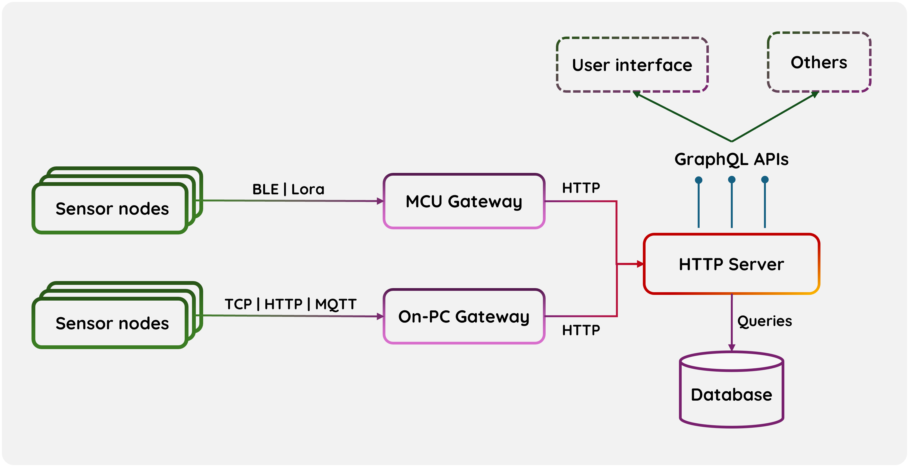

# An overview of the IoT Platform project

## Abstraction

Our first aim is to providing a maintainable and scalable IoT platform receiving, holding and managing a variety of sensor data. The primary features of this system include: 

- **Multi-protocol support:** Accepting and handling multi-type of wireless protocols: TCP, HTTP, MQTT, BLE, Lora, etc.

- **Data storage and management:** Storing and providing CRUD (Create | Read | Update | Delete) operations for multi-type of sensor data. 

- **Extensibility:** Giving methods for adding and supporting new types of sensor data, ensuring the platform remains adaptable to future needs.

- **Standardized APIs:** Giving standard rules and APIs for integrating other projects (such as lab projects), allowing them to easily send data to the platform.

- **User-friendly interface:** Giving a friendly user-interface to manage all the things.

After reaching this basic aim, we'll go for futher goals in next semester (such as smart plugs network, smart office, etc.) 

## Architecture

(Arrows indicate how sensor data moving and being stored around the system).

### Gateway

Gateways receive data from external sensor devices

The whole platform includes 2 types of gateway so that various wireless protocols can be supported:

- Gateways as On-PC gateway to support Internet-based Protocols (TCP, HTTP, MQTT, etc.).

- Gateways as MCU gateway to support other atenna-based protocols (Classic Bluetooth, BLE, Lora, etc.)

Gateways decode the data and forward them to master server via HTTP.

### Master server 

Master server as HTTP server provides GraphQL APIs to perform robust CRUD operations, 
easily handle data of any sensor types. Core features include:

- **Standardized APIs** to: 
	
	-> Create devices of any sensor type with device's name, owner, description, units of measurement, sampling rate, etc.
	
	-> Push data (single or multiple sensor values with sampling time) of defined devices.

	-> Read available data in JSON or CSV format.

	-> Support realtime update using websocket.

- **Authentication and authorization**: users with` basic privileges` can define their own sensor devices and push sensor data of those devices. 
Basic users can only see what they themselves have created. Users with `admin privileges`, on the other hand, 
can see and change all the things. User passwords are saved as SHA256 codes.

- **Guest**: Guests are unknown, not registered users. For easy approaching 
this system, in beta version, we still allow guests to create their devices and 
push their data, but guests' devices and data can be see by any user.

### User Interface

Browser-based Graphical User Interface is for easily creating sensor devices and managing all the data recorded. 
(Maybe) Support data analyzing and visualizing.

******

| What's next ? - [Database schema](database-schema.md) |
| ------------- |

October 2024 by Thai-Son Nguyen.

🧑‍💻🧑‍💻🧑‍💻 Happy coding !!! 🧑‍💻🧑‍💻🧑‍💻

