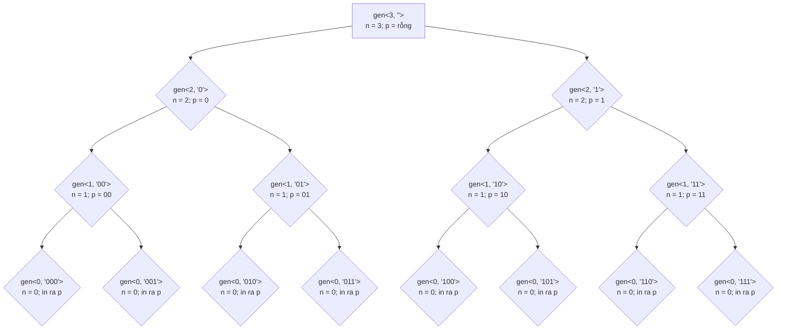

Đệ quy với bài toán xuất ra các số nhị phân n chữ số
======================

Đề bài
-----------------
Cho số n (0 <= n <= 20), in ra tất cả các số nhị phân có n chữ số 

VD:

```
Input: n = 3
Output:
000
001
010
011
100
101
110
111
```

Code mẫu 
----

```cpp
#include <iostream>
#include <string>
#include <vector>

using namespace std;

void gen(int n, string prefix) {
    if (n == 0) {
        cout << prefix << endl;
        return;
    }

    gen(n - 1, prefix + "0"); // Gọi đệ quy
    gen(n - 1, prefix + "1"); // Gọi đệ quy
}

int main() {
    int n;
    cin >> n;

    generateBinary(n, "");

    return 0;
}
```

Ý tưởng 
-----
Biến `prefix` dùng để lưu xâu đầu ra. Cứ mỗi 1 lần gọi đệ quy:

```cpp
generateBinary(n - 1, prefix + "0"); // Gọi đệ quy
```

```cpp
generateBinary(n - 1, prefix + "1"); // Gọi đệ quy
```
Biến `prefix` ban đầu là xâu rỗng.

Biến `prefix` được cộng thêm `0` hoặc `1` ra đằng sau, đồng thời `n` được truyền vào sẽ được bớt đi 1.

Có `n` lần tham số `n` bị giảm đi 1, cũng là có `n` lần biến `prefix` được nối đuôi `0` hoặc `1` ra đằng sau.

Đến khi `n` giảm còn `0` thì biến `prefix` đấy cũng đủ số kí tự.

Sơ đồ luồng gọi với n = 3
-------
**Lưu ý `p` viết tắt cho `prefix`**




 

* * *

🧑‍💻🧑‍💻🧑‍💻 Happy coding !!! 🧑‍💻🧑‍💻🧑‍💻

| [Bài trước: Đệ quy vỡ lòng](part6.md)  | |
| ------------- | ------------- |